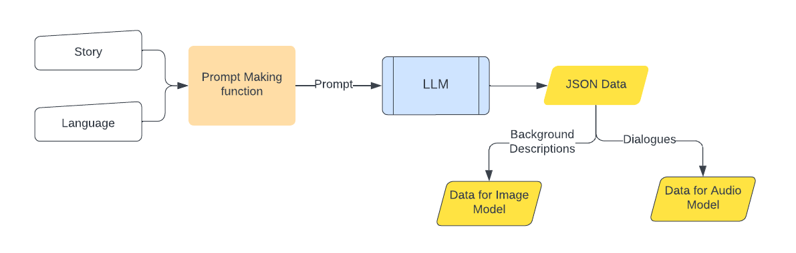
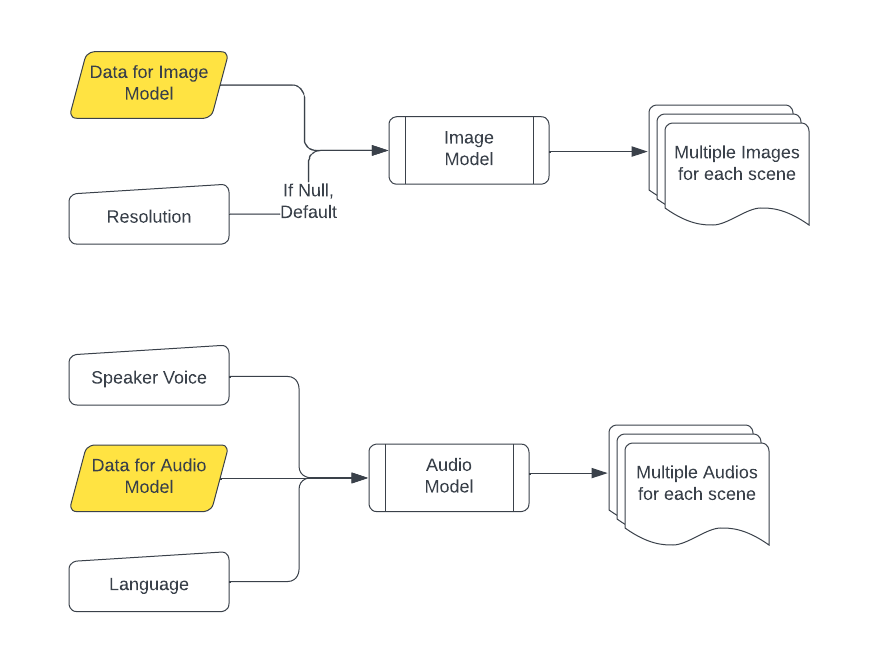
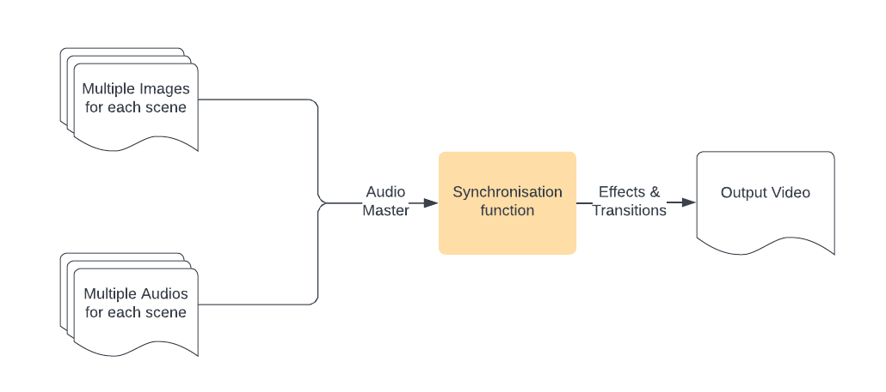
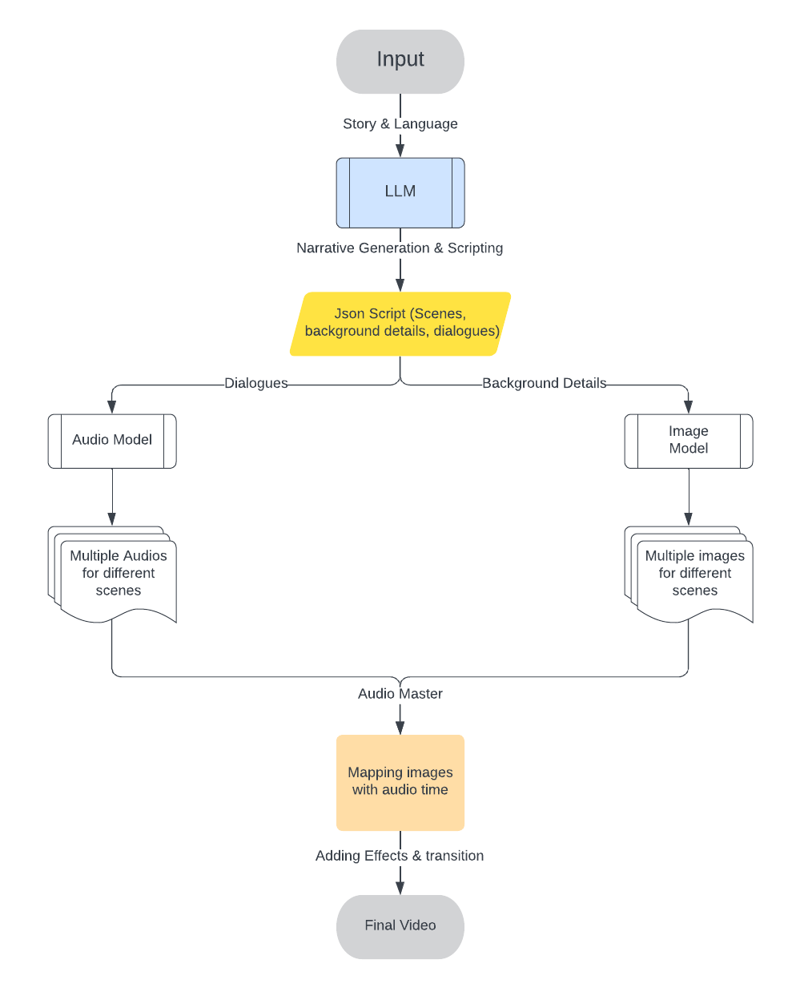

# Multilingual Story Generator

## Note

Backend for the project cannot be shown due to research restriction and is in process of being published.

## Overview

This project focuses on generating multilingual scripts from stories using the **Gemma LLM** (Large Language Model), fine-tuned on a custom dataset. The project supports **Hindi**, **English**, and **Punjabi**, and automatically generates scripts, scenes, background descriptions, and dialogues, which are then transformed into multimedia content such as videos.

## Features

- **Multilingual Support**: The model is fine-tuned to understand and generate scripts in three languages—Hindi, English, and Punjabi.
- **Story to Script Conversion**: Given a story, the model generates a script with detailed scene breakdowns, including character actions, background descriptions, and dialogues.
- **Image and Audio Generation**:
  - **Images** are generated using **SDXL** based on the scene background descriptions.
  - **Audio** is generated using **BarkTTS**, providing narration and sound effects for each scene.
- **Video Creation**: Generated images and audio are combined to produce a final video for each story.

## Workflow

1. **Prompt and Data Processing**  
   The story and language inputs are processed by a prompt-making function which converts them into a structured format that can be interpreted by the **LLM** to generate JSON data for both image and audio models.

2. **Audio and Image Generation**  
   The JSON data produced by the **LLM** provides detailed scene information, which is fed into:

   - The **Audio Model** for generating multiple audios per scene, using speaker voices and language preferences.
   - The **Image Model** for generating multiple images per scene, based on background descriptions.

3. **Narrative Generation and Scripting**  
   The core of the project involves generating a script with detailed scene breakdowns, dialogues, and background descriptions. These outputs are then used to generate images and audio.

4. **Video Merging**  
   The generated images and audios are merged, and effects and transitions are added to create the final video output.

### Process Flow Diagram

1. **Story Input and Script Generation**
   

2. **Image and Audio Generation**
   

3. **Video Creation**
   

4. **Overall System Architecture**
   

## Dataset Structure

The dataset is structured in JSON format with each entry representing a story and its associated scenes. Below is an example of the dataset structure:

```json
[
  {
    "story": "The story content",
    "language": "English",
    "scenes": [
      {
        "scene_number": 1,
        "character": {
          "active": ["Character1", "Character2"],
          "inactive": ["Character3"]
        },
        "background_information": "Prompt for image generation for this scene",
        "video_generation_info": {
          "background": "Background description for video",
          "objects": ["Object1", "Object2"],
          "action": "Description of actions happening"
        },
        "audio": {
          "narration": "Narration for the scene in English",
          "sound_effects": ["SoundEffect1", "SoundEffect2"],
          "sentiment_analysis": "Emotion conveyed in the narration"
        }
      }
    ]
  }
]
```

## Sample Outputs

Here are two sample video outputs generated by the system:

1. [Multilingual Video 1](.github/videos/multilingual_video1.mp4)
2. [Multilingual Video 2](.github/videos/multilingual_video2.mp4)

## Future Improvements

- **Add more language support**: Extend the model to support additional languages such as Spanish and French.
- **Implement character voice differentiation**: Introduce different voices for individual characters to create a more immersive and personalized audio experience.
- **Enhance video post-processing**: Improve the final video with more effects, transitions, and visual enhancements for a more polished output.
